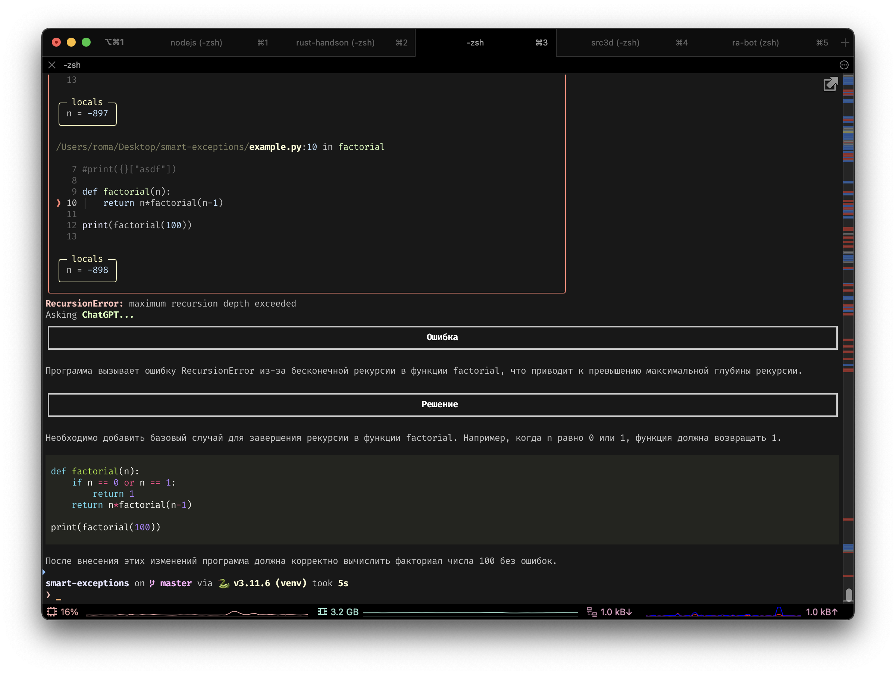

# smart-exceptions
Better Python Stacktraces with power of AI.
Now your problems are solved at the same moment they're arised!

## Installation
```console
pip install git+https://github.com/roma-guru/smart-exceptions
```

## Usage
In file:
```python
import smart_exceptions as se
se.install("your-openai-token")
...
```
In [debug] console global exception handler is suppressed and have to call GPT explicitly:
```python
>>> import smart_exceptions as se; se.install("your-openai-token", explicit=True)
>>> ...
>>> se.ask_gpt()
```

You can provide token explicitly or implicitly via _$OPENAI\_TOKEN_.
Also you can specify proxy explicitly or via _$OPENAI\_PROXY_.


## TODO
4. Other GPTs: Bard, Clade, Yandex
5. Dialog mode
6. Skip filesend from console
7. Docstrings
